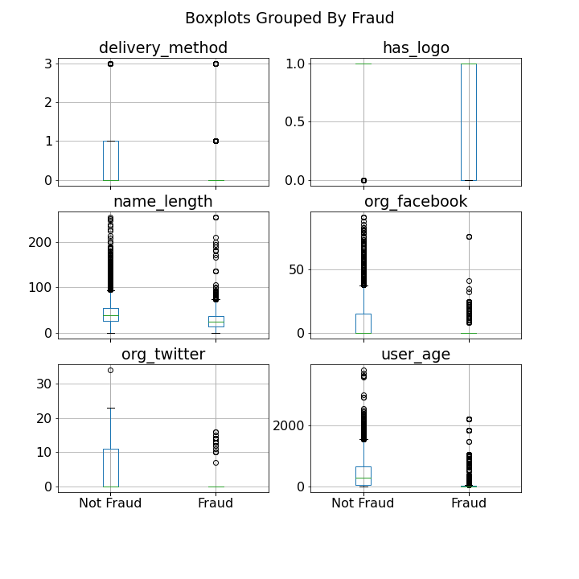
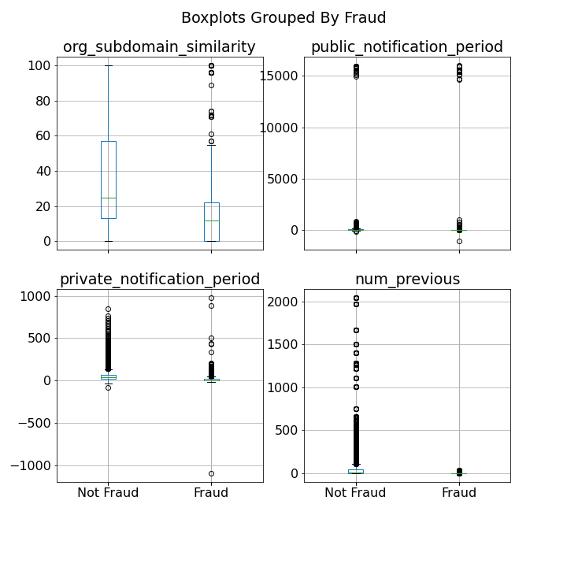

# Fraud Detection Case Study

By: Martha Wood, Justin Lansdale, Alex Wyman, and Jeff Bauerle

<!------>

# EDA

Reviewed each of the features to try to discern what we thought it represented, relative importance, and whether we thought it contained data leakage. 

### Data Leakage (removed)
1. Account Type (acct_type)
2. Global Ticket Sales (gts)
3. Approximate Payout Date (approx_payout_date)
4. Number of Payouts (num_payouts)
5. Sale Duration (sale_duration, sale_duration2)
6. Payee Name (payee_name)
7. Payout Type (payout_type)

# Feature Engineering

1. A Naive Bayes model was applied to the description to get a predict proba - the model was pickled, and then inserted as a feature into the main Random Forest model.

2. We engineered a feature to determine how similar the subdomain of the email is to organization name, theorizing that more professional and legitimate organizations will have higher similarity and be less prone to be fraud.

3. "Public Notification Period" - time elapsed between published time and start time

4. "Private Notification Period" - time elapsed between created time and event start time

5. Number of previous payouts...

6. "Percent Capitalized" - evaluated how much of the name contained capital letters. 

Feature Importance (insert graph here)

# Model

We used a random forest model and performed a RandomizedSearchCV for our hyperparameter tuning. (only if extra time)

insert rf_random.best_params_ here (only if extra time)

insert confusion matrix 

insert Precision-Recall curve

# Detection System App

Fraud was categorized into low risk (<20% probability), medium risk (20%-70% probability) and high risk (over 70% probability). 

A [Flask app](http://ec2-34-213-246-20.us-west-2.compute.amazonaws.com:8105) was published to the web to allow users to view fraud risk in real time. The user can the decide to start an investigation or mark the event as not fraudulent. The features with the most importance are listed on the home page with the risk assessment and name of the event. 

After determining the probability of fraud each event is stored in a Postgres database. 

